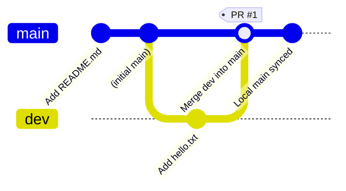

# Git & GitHub Workflow — Visual Guide

This document complements `TUTORIAL.md` by showing the **same workflow visually**.
The diagrams use [Mermaid](https://mermaid.js.org/) syntax, which GitHub renders
automatically inside `.md` files. (In VS Code, install the *Markdown Preview
Mermaid Support* extension to preview them.)

---

## 1. Big Picture — The Full Lifecycle

```
┌─────────────┐   git init     ┌─────────────┐   git add + commit  ┌──────────────┐
│ Empty Folder│ ─────────────▶ │ Local Repo  │ ──────────────────▶ │  1st Commit  │
└─────────────┘                └─────────────┘                     └──────┬───────┘
                                                                          │
                                          git remote add + git push       │
                                                                          ▼
                                                              ┌───────────────────┐
                                                              │  GitHub Remote    │
                                                              │  (origin/main)    │
                                                              └──────┬────────────┘
                                                                     │
                                              git checkout -b dev     │
                                              ────────────────────────▶│
                                                                     ▼
   ┌──────────────┐   git commit    ┌──────────────┐   git push     ┌──────────────┐
   │ Edit on dev  │ ◀────────────── │  Working on  │ ◀───────────── │  Local dev   │
   │ (hello.txt)  │ ───────────────▶│   dev branch │ ─────────────▶ │   branch     │
   └──────────────┘                 └──────────────┘                └──────┬───────┘
                                                                         │
                                              Open Pull Request          │
                                              on GitHub                  ▼
                                                              ┌───────────────────┐
                                                              │  PR: dev → main   │
                                                              └──────┬────────────┘
                                                                     │  Merge
                                                                     ▼
                                                              ┌───────────────────┐
                                                              │ main is updated   │
                                                              │ (hello.txt added) │
                                                              └──────┬────────────┘
                                                                     │  git pull
                                                                     ▼
                                                              ┌───────────────────┐
                                                              │  Local main is    │
                                                              │  in sync again ✅ │
                                                              └───────────────────┘
```

---

## 2. Branching & Merging — Commit Graph

This is what `git log --oneline --graph --all` looks like at the end of the
assignment. The `dev` branch's single commit is merged back into `main`.



**Reading the graph:**
- `main` starts with the initial `README.md` commit.
- A `dev` branch diverges from `main`.
- One new commit (`Add hello.txt`) lands on `dev`.
- The Pull Request merges `dev` back into `main` (the merge commit is tagged `PR #1`).
- `main` now contains everything from `dev`.

---

## 3. The Three States of Git

Understanding Git's three "areas" makes staging and committing intuitive:

```
┌──────────────────┐   git add    ┌──────────────────┐  git commit  ┌──────────────────┐
│  Working         │ ───────────▶ │  Staging Area    │ ───────────▶ │   Repository     │
│  Directory       │              │  (Index)         │              │   (.git folder)  │
│  (your files)    │ ◀─────────── │                  │ ◀─────────── │   commit history │
└──────────────────┘   git restore └──────────────────┘  git reset  └──────────────────┘
```

| Area | Where | Command to move INTO it |
|------|-------|-------------------------|
| Working directory | Your actual files on disk | (you edit files here) |
| Staging area (index) | Intermediate holding zone | `git add <file>` |
| Repository | Committed history in `.git/` | `git commit -m "..."` |

---

## 4. Remote Sync Mental Model

```
       LOCAL                                            REMOTE (GitHub)
┌─────────────────┐                              ┌─────────────────┐
│   main (HEAD)   │  ──── git push ────────────▶ │   origin/main   │
│                 │  ◀─── git pull ───────────── │                 │
└─────────────────┘                              └─────────────────┘
┌─────────────────┐                              ┌─────────────────┐
│   dev (HEAD)    │  ──── git push ────────────▶ │   origin/dev    │
│                 │  ◀─── git pull ───────────── │                 │
└─────────────────┘                              └─────────────────┘
        ▲                                               ▲
        │            Pull Request (merge)              │
        └──────────────── dev ──▶ main ────────────────┘
```

---

## 5. Pull Request Flow (GitHub side)

```
   1. Push branch                2. Open PR               3. Review
   ─────────────                 ─────────                ──────────
   git push -u origin dev   →   New Pull Request     →   Reviewer checks
                                                              │
                                                              ▼
   4. Merge                      5. Sync local            ┌────────────┐
   ─────────                     ─────────────            │  Approved  │
   "Merge pull request"     →    git checkout main        └────────────┘
                                  git pull origin main
                                                              │
                                                              ▼
                                                     ┌─────────────────┐
                                                     │  main updated   │
                                                     │  locally + remote│
                                                     └─────────────────┘
```

---

## 6. Decision Guide — When to Use What

```
        ┌─────────────────────────────────────────────┐
        │  Do I want to save this change permanently? │
        └────────────────────┬────────────────────────┘
                 YES          │           NO
                      ▼                      ▼
        ┌──────────────────────┐   ┌────────────────────┐
        │ Is it a finished,    │   │  Just staging for  │
        │ reviewable feature?  │   │  the next commit   │
        └──────┬───────────────┘   └─────────┬──────────┘
          YES  │  NO                         ▼
             ▼ │  ▼                   git add <file>
    Open a PR  │  commit directly
               │  on a branch
               ▼
        git commit
        git push
        Open PR
```

---

## 🎯 Key Visual Takeaways

1. **`main` is sacred** — never commit experimental work directly to it.
2. **Branches are cheap** — create one per feature/fix.
3. **PRs are the gate** — code on a branch only reaches `main` through a merged PR.
4. **Push = share locally → remote**, **Pull = remote → local**. Always pull before you push to avoid surprises.
5. **The merge commit** is the bridge that brings `dev`'s work into `main`.